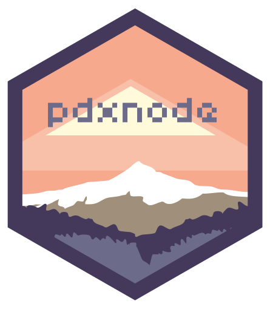

<h1 align="center">
  
   
  PDXNode
   
   
</h1>

<h4 align="center">Portland's very own Node.js usergroup</h4>

  
  
  

## What's this all about?

PDXNode is a Node.js usergroup based in Portland, Oregon.

We organize two meetups every month: one for talks, one for hacks.

### Presentation Nights

Every 2nd Thursday we put on a presentation night at [Alchemy Code Lab](http://www.alchemycodelab.com/) where the goal is to provide [high-quality presentations](https://www.youtube.com/channel/UCI8MIw5A7ALtIvNHsrYJbjg) from people in the Node community locally and abroad. At the present we typically have local speakers present in person, and other geographically distributed speakers present remotely via [talky.io](https://talky.io/).

### Hack Nights

Every last Thursday we put on a hack night at [Ctrl-H Hackerspace](http://pdxhackerspace.org/) where the goal is to provide a fun and easy-going environment for individuals & groups to hack on their own projects and ask questions along the way, as well as support begginers and people who are new to Node with help in answering questions and pair-coding.

## How To Talk

**We use github to submit talks: lightning, long-form, and otherwise.**

See the [lightning talk](./talks/lightning.md) and [longform talk](./talks/longform.md)
templates for more details on submitting a talk proposal!

See the [request a talk](./talks/request-a-talk.md) to submit what you'd love to experience at
our meetup.

Come talk to us in [#pdxnode](http://webchat.freenode.net/?channels=pdxnode&uio=d4) on freenode or via our [gitter channel](https://gitter.im/pdxnode/Lobby).

## Code of Conduct

This usergroup is intended to be a safe, welcoming space for collaboration. All participants are expected to adhere to our [code of conduct](./code-of-conduct.md). Thank you for being kind to each other!
